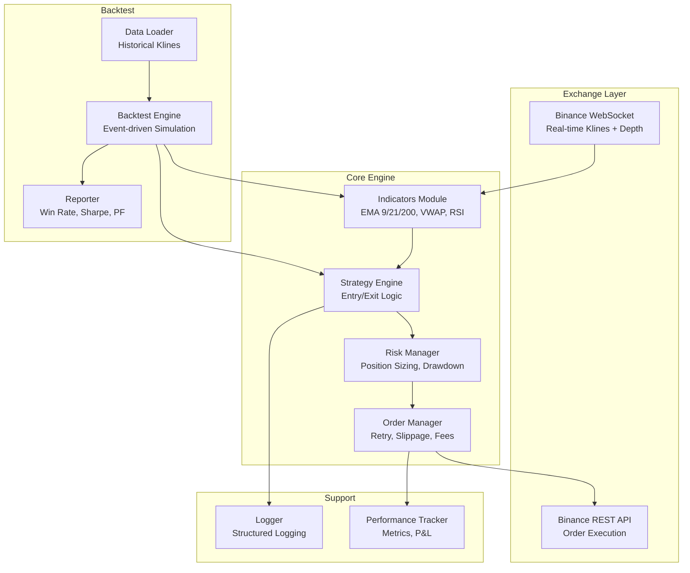

# Binance Institutional Scalping Bot

High-frequency scalping system for BTCUSDT/ETHUSDT using EMA/VWAP/RSI confluence, async execution, and institutional-grade risk management.

---

## Architecture



---

## Project Structure

```
c:\TradingBots\binance\
├── config/
│   ├── __init__.py
│   └── settings.py            # All constants, API config, strategy params
├── core/
│   ├── __init__.py
│   ├── indicators.py          # EMA, VWAP, RSI, MACD, volume spike
│   ├── strategy.py            # Long/short entry, exit, trailing stop
│   ├── risk_manager.py        # Sizing, drawdown, consecutive loss tracking
│   └── order_manager.py       # Order placement, retry, slippage guard
├── exchange/
│   ├── __init__.py
│   ├── ws_feed.py             # Async WebSocket kline + depth stream
│   └── rest_client.py         # Async REST for orders + account info
├── backtest/
│   ├── __init__.py
│   ├── data_loader.py         # Fetch historical klines from Binance
│   ├── engine.py              # Event-driven backtester
│   └── reporter.py            # Metrics: Sharpe, PF, expectancy, drawdown
├── utils/
│   ├── __init__.py
│   ├── logger.py              # Rotating file + console structured logs
│   └── performance.py         # Trade journal, real-time P&L tracking
├── main.py                    # Live bot entry point (async)
├── run_backtest.py            # Backtest entry point
├── requirements.txt
└── .env.example               # API key placeholders
```

---

## Proposed Changes

### Config Module

#### [NEW] [settings.py](file:///c:/TradingBots/binance/config/settings.py)

All tunable parameters in one place:

| Parameter | Value | Notes |
|-----------|-------|-------|
| `PAIRS` | `["BTCUSDT", "ETHUSDT"]` | High liquidity only |
| `TIMEFRAME` | `1m` | Primary scalping frame |
| `EMA_FAST` | `9` | Micro trend |
| `EMA_SLOW` | `21` | Micro trend |
| `EMA_TREND` | `200` | Macro filter |
| `RSI_PERIOD` | `7` | Momentum timing |
| `VWAP_PERIOD` | `20` | Session VWAP |
| `VOL_SPIKE_MULT` | `1.5` | Volume above 20-SMA × 1.5 |
| `TP_MIN / TP_MAX` | `0.3% / 0.8%` | Take profit range |
| `SL_MIN / SL_MAX` | `0.2% / 0.4%` | Stop loss range |
| `TRAIL_ACTIVATE` | `0.2%` | Trailing stop trigger |
| `RISK_PER_TRADE` | `0.75%` | Default risk |
| `MAX_CONCURRENT` | `3` | Max open positions |
| `MAX_CONSEC_LOSS` | `3` | Circuit breaker |
| `MAX_DAILY_DD` | `2%` | Daily drawdown limit |

---

### Core Module

#### [NEW] [indicators.py](file:///c:/TradingBots/binance/core/indicators.py)

Pure numpy/pandas indicator calculations:
- `compute_ema(series, period)` → EMA values
- `compute_vwap(high, low, close, volume)` → VWAP
- `compute_rsi(close, period)` → RSI
- `compute_macd(close)` → MACD histogram (optional confirmation)
- `detect_volume_spike(volume, period, multiplier)` → boolean
- `compute_all(df)` → DataFrame with all indicators attached

> [!IMPORTANT]
> All indicators use vectorized numpy operations for speed. No ta-lib dependency — pure implementation for portability.

#### [NEW] [strategy.py](file:///c:/TradingBots/binance/core/strategy.py)

Signal generation with strict confluence:

**Long Entry** (ALL must be true):
1. `close > vwap`
2. `ema9` crosses above `ema21` (current bar)
3. `close > ema200`
4. `rsi` crosses above 40 (was ≤40 previous bar, now >40)
5. Volume spike confirmed

**Short Entry** (ALL must be true):
1. `close < vwap`
2. `ema9` crosses below `ema21`
3. `close < ema200`
4. `rsi` crosses below 60 (was ≥60, now <60)
5. Volume spike confirmed

**Exit Logic**:
- TP hit → close position
- SL hit → close position
- Trailing stop: activates at +0.2%, trails at distance = SL

**Filters**:
- Skip trade if ATR < threshold (low volatility)
- Skip if within 0.1% of recent S/R level (20-bar high/low)

#### [NEW] [risk_manager.py](file:///c:/TradingBots/binance/core/risk_manager.py)

- `calculate_position_size(balance, risk_pct, sl_distance)` → quantity
- `can_open_trade()` → checks concurrent positions, consecutive losses, daily P&L
- `record_trade_result(pnl)` → updates counters
- `reset_daily()` → resets daily drawdown tracker
- Adaptive sizing: reduce size by 50% after 2 consecutive losses

#### [NEW] [order_manager.py](file:///c:/TradingBots/binance/core/order_manager.py)

- Async order placement via REST client
- Slippage guard: reject if spread > 0.05%
- Fee calculation: 0.1% maker/taker (adjustable for BNB discount)
- Retry logic: 3 attempts with exponential backoff
- Order types: LIMIT for entry, STOP_MARKET for SL, TAKE_PROFIT_MARKET for TP

---

### Exchange Module

#### [NEW] [ws_feed.py](file:///c:/TradingBots/binance/exchange/ws_feed.py)

- Async WebSocket connection to Binance kline stream
- Subscribes to `{pair}@kline_1m` for each pair
- Maintains rolling DataFrame of last 250 candles per pair
- Optional: `{pair}@depth5` for order book imbalance
- Auto-reconnect on disconnect

#### [NEW] [rest_client.py](file:///c:/TradingBots/binance/exchange/rest_client.py)

- Async wrapper around Binance REST API (using `aiohttp` + HMAC signing)
- Methods: `place_order()`, `cancel_order()`, `get_balance()`, `get_exchange_info()`
- Rate limit awareness
- Testnet support toggle

---

### Backtest Module

#### [NEW] [data_loader.py](file:///c:/TradingBots/binance/backtest/data_loader.py)

- Fetch historical 1m klines from Binance API
- Cache to local CSV for repeat runs
- Support date range selection
- Auto-paginate (Binance returns max 1000 per request)

#### [NEW] [engine.py](file:///c:/TradingBots/binance/backtest/engine.py)

- Event-driven: iterate candle-by-candle
- Apply indicators → strategy → risk manager → simulate orders
- Track: entries, exits, P&L per trade, equity curve
- Account for fees (0.1% per side)
- Account for slippage (configurable, default 0.01%)

#### [NEW] [reporter.py](file:///c:/TradingBots/binance/backtest/reporter.py)

Output metrics:

| Metric | Target |
|--------|--------|
| Total trades | ≥1000 |
| Win rate | Report actual (no inflation) |
| Profit factor | >1.5 |
| Max drawdown | Report % |
| Expectancy/trade | Report $ and % |
| Sharpe ratio | >1.0 |
| Avg win / Avg loss | Report ratio |
| Equity curve | Matplotlib chart saved to `results/` |

---

### Utils Module

#### [NEW] [logger.py](file:///c:/TradingBots/binance/utils/logger.py)

- Structured JSON logging
- Rotating file handler (10MB, 5 backups)
- Console handler with color
- Log levels: TRADE, SIGNAL, RISK, ERROR

#### [NEW] [performance.py](file:///c:/TradingBots/binance/utils/performance.py)

- Trade journal: timestamp, pair, side, entry, exit, P&L, duration
- Save to CSV after each trade
- Real-time equity tracking
- Daily summary generation

---

### Entry Points

#### [NEW] [main.py](file:///c:/TradingBots/binance/main.py)

- Parse CLI args (pairs, testnet toggle)
- Initialize exchange connections
- Run async event loop: WS feed → indicators → strategy → risk → orders
- Graceful shutdown on SIGINT

#### [NEW] [run_backtest.py](file:///c:/TradingBots/binance/run_backtest.py)

- CLI: `python run_backtest.py --pair BTCUSDT --start 2025-01-01 --end 2025-12-31`
- Fetch/load data → run engine → print report → save equity chart

---

## Open Questions

> [!IMPORTANT]
> **API Keys**: Do you have Binance API keys ready? Should I target **Testnet** or **Production** by default?

> [!IMPORTANT]
> **Futures vs Spot**: Should this trade **USDT-M Futures** (supports shorting natively) or **Spot** (long-only unless margin)? The short setup requires futures or margin.

> [!NOTE]
> **MACD**: The spec lists MACD as optional. I'll include it as a toggleable confirmation filter, disabled by default, to keep active indicators at 3 (EMA, VWAP, RSI).

---

## Verification Plan

### Automated Tests
1. Run backtest on BTCUSDT 6-month historical data
2. Verify ≥1000 trades generated
3. Confirm all metrics print correctly
4. Validate indicator calculations against known values

### Manual Verification
1. Run on Binance Testnet with paper trades
2. Verify WebSocket feed stays connected for 1+ hours
3. Confirm order placement and cancellation work
4. Check logs rotate correctly

Done By Vatsal
